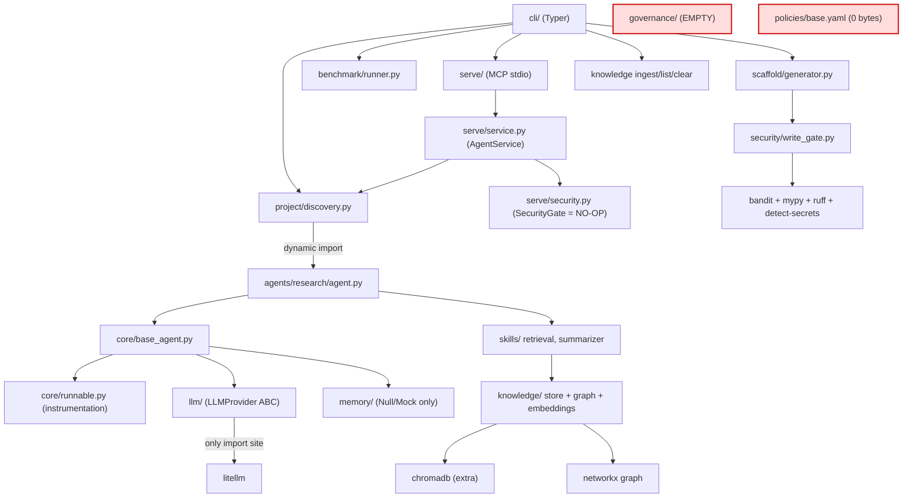
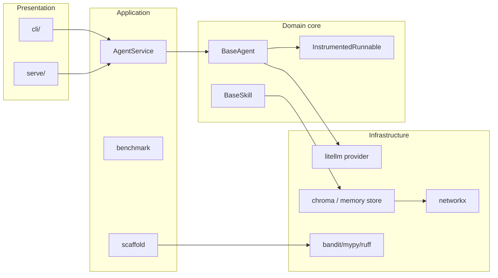

# Lottie Orchestrator — Architecture, Security & Production-Readiness Audit

**Audit date:** 2026-06-12
**Auditor role:** Principal Software Architect / Staff+ AI Platform Engineer / Security Engineer / Technical Writer
**Repository:** `lottie-orchestrator` (import name `lottie`)
**Branch audited:** `docs/readme-codecov`
**Method:** Evidence-based static read of the entire repository (224 tracked files, ~15,000 LOC incl. tests, ~6,700 LOC non-test). Every claim below is anchored to a file/line. Where the code could not substantiate a documented claim, that is stated explicitly rather than assumed.

> **Reading note.** This document is deliberately critical. Lottie is an early-phase project (self-described Phase 1 shipped, Phase 4 in progress) and many gaps below are *expected* for that maturity. The value of the audit is separating (a) what the code actually does, from (b) what the README/CLAUDE.md/spec *claim* it does — because that gap is large and, in the security domain, materially misleading.

---

## Executive Summary

### Overall assessment

Lottie is a **well-engineered single-agent runner with a knowledge-retrieval subsystem and a clean LLM-provider abstraction**, wrapped in documentation that describes a **governed, secured, multi-agent orchestration platform that does not yet exist in the code**. The engineering that *is* present is of high quality: disciplined type safety, a tidy template-method core, provider-agnostic LLM access via a single `litellm` chokepoint, a real (non-LLM, deterministic) security-scanning toolchain for generated code, and a real MCP stdio server built on the official SDK. Test discipline is good at the unit/integration layer.

However, the headline capabilities implied by the project's name and its own governing document (`CLAUDE.md`) are **absent or stubbed**:

- **No multi-agent orchestration exists.** The system runs exactly one agent at a time. There is no workflow engine, no agent-to-agent messaging, no routing, no supervisor, no parallel runner. "Multi-agent" appears only in marketing copy and test fixtures.
- **No governance exists.** `governance/` is an empty module; `policies/base.yaml` is a 0-byte file; there is no policy engine, audit logger, or cost tracker. Policy names are passed around as display strings and never evaluated.
- **The runtime security gate is a no-op.** `serve/security.py::SecurityGate.check_input/check_output` return their input unchanged. Three of the security skills the rules treat as non-negotiable — `InputSanitizerSkill`, `OutputValidationSkill`, `CapabilityEnforcerSkill` — **do not exist anywhere in the codebase**.
- **The whole system is synchronous.** The only `async` code exists to satisfy the MCP SDK and bridges to blocking agent code via a threadpool.

The security scanning that *is* real (prompt-injection regex on knowledge ingest; bandit/mypy/ruff/secret-detection on AI-generated code) is genuinely wired — but the injection scanner is bypassable by design (no Unicode normalization, English-literal patterns), and the bandit gate **fails open** on malformed output.

### Key strengths

1. **Clean LLM abstraction with a single vendor chokepoint** — `litellm` is imported in exactly one file; agents depend only on the `LLMProvider` ABC. Genuine provider portability. (`llm/litellm_provider.py:12`)
2. **Disciplined type safety** — `mypy --strict`, PEP 695 generics bounded to `BaseModel`, zero `Any`, zero `# type: ignore` in the core. (`core/runnable.py:30`)
3. **Centralized instrumentation via template method** — all latency/token/cost capture lives in one `run()` method; subclasses implement only `_execute`. (`core/runnable.py:53-91`)
4. **Real, deterministic security toolchain for code generation** — bandit + mypy + ruff + detect-secrets actually run as subprocesses with write-then-scan-then-rollback semantics. (`security/write_gate.py:21-64`)
5. **Real knowledge subsystem** — ChromaDB integration, networkx dependency graph with impact/cycle/orphan/stale queries, real embeddings via litellm. (`knowledge/`)
6. **A real reference agent** — `ResearchAgent` is a working, knowledge-grounded, citation-emitting agent that correctly composes skills and never imports an SDK. (`agents/research/agent.py`)

### Major risks

| # | Risk | Severity |
|---|------|----------|
| R1 | Runtime agent I/O security gate is an identity no-op, contradicting "non-negotiable" rules 8–9 | **Critical** (if `serve` is exposed) |
| R2 | Capability enforcement (rule 11) is unimplemented — `capabilities` lists are cosmetic | **High** |
| R3 | Governance (audit log, policy engine, cost tracker) is entirely absent despite being advertised as "built in" | **High** |
| R4 | bandit code scanner fails *open* on subprocess/JSON error — a crashed or missing scanner reads as "clean" | **High** |
| R5 | Prompt-injection scanner is regex-only, English-literal, no Unicode normalization — trivially bypassable | **Medium** |
| R6 | No durable execution, no state persistence, no retry — `retry_count` is recorded but never incremented | **Medium** |
| R7 | Sync-only core with per-instance mutable `_active_ctx` — not concurrency-safe under reuse | **Medium** |
| R8 | Dependency versions are future-dated and entirely uncapped; `mypy`+`ruff` leak into the runtime install | **Medium** |
| R9 | CI runs no security scan and enforces no coverage gate; mypy restricted to `src/` only | **Medium** |
| R10 | Documentation materially overstates implemented capability (governance, multi-agent, security) | **High** (trust/diligence risk) |

### Top recommendations (condensed — full list at end)

1. **Reconcile documentation with reality.** Either build the gates/governance or rewrite README/CLAUDE.md to mark them as roadmap. The current gap is an enterprise-trust and due-diligence liability.
2. **Make the bandit gate fail closed** and check `returncode`. (1-line-class change, high security value.)
3. **Wire the runtime `SecurityGate`** to the existing real scanners, or remove the claim that it wraps every run.
4. **Implement capability enforcement** as a real interception point, or stop documenting it as enforced.
5. **Add a security stage and coverage gate to CI**; extend mypy to `skills/` and `agents/`.

**Overall architecture score: 5.5 / 10** — strong foundations and clean code, but the platform-level claims (orchestration, governance, runtime security) are unbuilt, and several "non-negotiable" security rules are unenforced.

---

## Repository Overview

### Project purpose

Per `CLAUDE.md` and `README.md`: a *"provider-agnostic multi-agent framework with shared knowledge & AI governance"* intended to work across Claude Code, Cursor, Codex, and any LLM. The stated pillars are: provider abstraction, a layered knowledge graph, security gates on all I/O, capability-scoped agents, and governance (policy + audit + cost).

**Ground truth:** a provider-agnostic *single-agent* runner + knowledge-retrieval library + code-scaffolding generator + MCP stdio server. Knowledge and provider abstraction are real; orchestration, governance, and runtime security gates are not.

### Major components

| Module | Path | Status | Role |
|--------|------|--------|------|
| Core | `src/lottie/core/` | **Real** | `InstrumentedRunnable`, `BaseAgent`, `BaseSkill`, metrics |
| LLM | `src/lottie/llm/` | **Real** | `LLMProvider` ABC, `LiteLLMProvider`, `MockLLMProvider` |
| Knowledge | `src/lottie/knowledge/` | **Real** (retrieval orchestration partial) | manifest, graph, ingest, chunking, embeddings, vector stores |
| Security | `src/lottie/security/` | **Partial** | real scanners (injection/secret/bandit/mypy/ruff) + write gate; 3 named skills missing |
| Serve / MCP | `src/lottie/serve/` | **Real (stdio)** | MCP server, `AgentService`; security gate is a stub |
| Memory | `src/lottie/memory/` | **Stub** | interface + schema real; only mock/null backends |
| Benchmark | `src/lottie/benchmark/` | **Real** | per-provider eval runner with metrics |
| CLI | `src/lottie/cli/` | **Mostly real** | Typer app; some documented commands missing |
| Scaffold | `src/lottie/scaffold/` | **Real** | `lottie create` + AI `--from-desc` generator |
| Project | `src/lottie/project/` | **Real** | config + filesystem discovery |
| Governance | `src/lottie/governance/` | **Empty** | 0-byte `__init__.py` only |
| Agents (reference) | `agents/research/` | **Real** | the only working non-framework agent |
| Skills (reference) | `skills/{chunker,retrieval,summarizer,document_ingest}/` | **Real** | deterministic + one LLM skill |

### Architectural style

Layered, library-first, synchronous, template-method core with dependency injection. The dependency direction is clean: `core → llm`, `core → memory`, with `llm/base.py` depending on nothing internal. Agents are user code discovered from the filesystem (`agents/<name>/agent.py`) and dynamically imported on demand.

### High-level dependency graph



---

## Architecture Review

### Current architecture

**Core (the spine).** `InstrumentedRunnable[InputT: BaseModel, OutputT: BaseModel]` (`core/runnable.py:30`) is an abstract template-method base. Its single public method `run(data)` (`runnable.py:53`) wraps `_execute(data)` (the only abstract subclasses implement) with instrumentation: it creates a `RunContext`, times the call with `perf_counter`, and in a `finally` block assembles a `RunMetrics` record (latency, tokens, cost, success, git version) and appends it as a JSON line under `.lottie/benchmarks/<name>.jsonl` (`runnable.py:66-91`, `metrics.py:75-89`). Errors are recorded then **re-raised** — instrumentation never swallows exceptions (`runnable.py:61-64`).

`BaseAgent` (`core/base_agent.py:23`) adds an LLM and memory client, and a `complete(messages, model_params)` method (`base_agent.py:49`) that is the *only* token/cost capture path: it calls `self.llm.complete(...)` then folds usage into the active `RunContext` (`base_agent.py:55-57`). `BaseSkill` (`core/base_skill.py:19`) adds nothing — no LLM, no accumulator — which produces a real telemetry gap for LLM-using skills (see Code Quality).

**LLM layer.** `LLMProvider` (`llm/base.py:42`) is a two-method ABC (`model` property, `complete`). `LiteLLMProvider` (`llm/litellm_provider.py:17`) is the only real provider and the only place `litellm` is imported. `build_provider(model)` (`llm/__init__.py:6`) is the single construction site. Model ids are free-form strings (`"anthropic/claude-sonnet-4-6"`), so provider swap is genuinely a config change.

**Knowledge layer.** Files are the source of truth; a networkx graph is the query layer built at runtime from the manifest (`knowledge/graph.py:74-75`), consistent with the stated design. `DocumentIngestSkill` (`knowledge/ingest.py:328`) loads → security-scans → writes a draft → chunks → embeds → stores. Vector storage has two real backends: `InMemoryVectorStore` (brute-force cosine) and `ChromaStore` (persistent, cosine HNSW). Embeddings are real via `litellm.embedding`.

**Serve / MCP.** `serve_stdio` (`serve/mcp_server.py:98`) runs the official MCP SDK's stdio server. Each healthy discovered agent becomes one MCP tool whose `inputSchema` is the agent's Pydantic JSON schema (`mcp_server.py:41-52`). Agent execution is offloaded off the event loop via `anyio.to_thread.run_sync` (`mcp_server.py:65`) — confirming the core is blocking/sync.

### Dependency analysis

- **Direction is clean and acyclic at the module level.** `core` never imports `cli`/`serve`/`agents`. `llm/base.py` is dependency-free internally. Security scanners are leaf modules. No import cycles were observed.
- **Coupling hotspot: `project/discovery.py`** is imported by `cli/run`, `cli/serve`, `serve/service`, `benchmark/runner`, and `scaffold`. It mutates `sys.path` on every dynamic import and caches modules keyed on root path only (`discovery.py:80-88`) — a documented hot-reload hazard for the long-lived MCP server.
- **`litellm` coupling is deliberately funneled** to one file — the best-isolated external dependency in the repo.

### Layer analysis



Layering is respected. The one violation worth noting: there is **no security/policy cross-cutting layer** wrapping the domain core, despite `CLAUDE.md` describing a `SecurityGate` that "wraps every agent run." The run path goes straight from `run()` to `_execute()` with no pre/post hooks (`runnable.py:53-67`).

### Architectural Strengths

| Strength | Impact | Evidence |
|----------|--------|----------|
| Single LLM vendor chokepoint | True provider portability; no lock-in | `llm/litellm_provider.py:12`; no `anthropic`/`openai` import anywhere |
| Template-method instrumentation | Uniform, un-bypassable-by-accident metrics; zero subclass boilerplate | `core/runnable.py:53-91` |
| Strict typing, PEP 695 generics, zero `Any` | High maintainability, refactor safety | `core/runnable.py:30`; `pyproject` `mypy strict=true` |
| Pydantic v2 at every boundary | No raw dicts/strings crossing agent/skill edges | `llm/base.py:19-39`; all `schema.py` files |
| Real code-gen security toolchain w/ rollback | Generated code is scanned before it persists | `security/write_gate.py:43-52` |
| Knowledge graph w/ impact/cycle/stale queries | Genuine dependency reasoning over docs | `knowledge/graph.py:103-200` |
| MCP server on official SDK, agents auto-exposed as tools | Real interop surface | `serve/mcp_server.py:14-83` |
| Failure isolation in discovery | One broken agent can't crash `status`/`serve`/tool-listing | `discovery.py:53-55`; `mcp_server.py:45-47` |

### Architectural Risks

| Risk | Severity | Evidence | Recommendation |
|------|----------|----------|----------------|
| Runtime `SecurityGate` is an identity no-op | **Critical** | `serve/security.py:11-20` (`return text`, `# TODO(phase1)`) | Wire to real scanners or delete the "wraps every run" claim |
| No multi-agent orchestration despite the name | **High** | No workflow/mesh/router module; `AgentService.run_agent` runs one agent (`service.py:57-118`) | Build a real orchestration layer or reframe as single-agent runtime |
| Capability enforcement unimplemented | **High** | No `CapabilityEnforcerSkill`; `capabilities` only displayed (`registry.py:85`) | Add an interception point in `BaseAgent`'s skill-call path |
| Governance entirely absent | **High** | `governance/__init__.py` 0 bytes; `policies/base.yaml` 0 bytes; no engine | Implement or mark Phase 3 in docs |
| bandit gate fails open | **High** | `code_scanner.py:40-43` returns `findings=[]` on `JSONDecodeError/KeyError/TypeError`; `returncode` unchecked | Fail closed; check return code; verify bandit installed |
| Per-instance mutable `_active_ctx` | **Medium** | `runnable.py:46,55,67` — concurrent `run()` on one instance clobbers context | Thread/async-local context or per-call object |
| No retry/timeout on LLM calls | **Medium** | No backoff anywhere; `retry_count` recorded but never incremented (`metrics.py:47`) | Add bounded retry + timeout at provider layer |
| Sync-only core | **Medium** | async only in `mcp_server.py`, bridged via threadpool (`mcp_server.py:65`) | Plan an async core before scaling concurrency |
| Module import cache keyed on root only | **Medium** | `discovery.py:80-88` — stale module on in-place edit for long-lived `serve` | Content-hash or mtime keying; or per-request import |
| Structured-then-semantic retrieval unbuilt | **Medium** | `RetrievalQuery/Result` defined, never consumed; rule 16 unimplemented | Implement the orchestration or remove dead models |

---

## AI Platform Review

### Agent design

- **Lifecycle.** `agent.run(data)` → instrumented `_execute` → optional `self.complete(...)` for LLM → returns a typed Pydantic output. Metrics persisted on every run. (`runnable.py:53`; `base_agent.py:49`)
- **Responsibilities/boundaries.** Agents hold an `LLMProvider` and a `MemoryClient` and nothing else — no skill registry, no capability list, no config reference inside the runtime object (`base_agent.py:28-43`). They compose skills by direct instantiation (see `ResearchAgent.from_project`, `agent.py:94-150`).
- **Communication.** **None between agents.** The only composition is agent→skill and agent→memory. There is no message bus, no shared blackboard, no handoff. (`agents/research/agent.py` composes `RetrievalSkill` + `SummarizerSkill`; no agent-to-agent path exists anywhere.)
- **The reference agent is genuinely good:** grounded prompt with explicit no-fabrication instruction, numbered-context citation discipline, DI factory wiring embedder + store + graph + skills, LLM accessed only through `self.complete`. Its documented defect: it re-chunks and re-embeds the *entire corpus on every construction* (`agent.py:132` TODO) — fine for a demo, fatal for production latency/cost.

### Skills

- **Abstraction.** `BaseSkill[InputT, OutputT]` — typed in/out, deterministic by contract (`base_skill.py:1-25`). Four reference skills: `ChunkerSkill` (deterministic), `RetrievalSkill` (deterministic, embed+query+graph-expand), `SummarizerSkill` (the one LLM skill), `DocumentIngestSkill` (re-export of the knowledge ingest skill).
- **Safety.** Skills have no I/O guards of their own; they trust their typed inputs. The capability system that is supposed to constrain which skills an agent may call **does not exist at runtime** (rule 11 unenforced).
- **Discoverability.** Filesystem scan of `skills/<name>/skill.py` (`discovery.py:36`); listed via `lottie list skills`. No semantic skill registry, no tool-description generation for skills (only agents get MCP tool descriptions).
- **Telemetry gap.** `SummarizerSkill` calls the LLM but its token usage is *not* accumulated into any `RunContext` (`summarizer/skill.py:142` TODO) — so `last_metrics` reports 0 tokens for skills, undercounting benchmark cost.

### LLM layer

- **Provider abstraction: excellent.** Two-method ABC; one real provider; one mock; one construction site. No SDK leak. (`llm/`)
- **Vendor lock-in risk: low.** Single `litellm` import; model ids are strings. The residual lock-in is *to litellm itself*, not to any model vendor.
- **Prompt handling.** Plain `list[Message]` with `system/user/assistant` roles (`llm/base.py:16-23`). Prompts live in per-agent `prompts.py` modules. No prompt templating engine, no prompt versioning, no prompt registry.
- **Structured outputs: NOT supported by the abstraction.** `LLMResponse.content` is a raw `str` (`base.py:36`); no JSON mode, no response-model coercion, no tool-calling fields. `model_params` is an opaque pass-through (`Mapping[str, object]`), so any structured output is the caller's responsibility (e.g. `ScaffolderAgent` regex-extracts the outermost `{...}` and validates — `scaffolder_agent.py:31-45`). This is a real platform limitation for an "agent framework."
- **Reliability primitives: absent.** No retry, no timeout, no rate-limit handling. The only LLM-layer guard is a `try/except` around cost pricing that returns `0.0` (`litellm_provider.py:48-51`). A malformed response will raise unguarded at `response.choices[0].message.content` (`litellm_provider.py:36`).

### Knowledge layer

- **Ingestion.** Real pipeline; **rule 10 is correctly enforced** — every source is run through `PromptInjectionScanSkill` and `SecretDetectionSkill` before any store write (`ingest.py:356-362`). Flagged sources are skipped. *Caveat:* a second ingestion path, `index_manifest` (`index.py:55-56`), intentionally bypasses the security gate (justified as already-vetted files) — a second write path not covered by rule 10.
- **Frontmatter validation: effectively absent.** Rule 14 lists seven required fields (`id, layer, scope, tags, status, last_verified, depends_on`); the parser *never raises* and silently defaults/coerces all of them (`frontmatter.py:88-146`). A file missing every required field loads cleanly. `last_verified` is read by stale-detection but unvalidated, so `stale()` silently no-ops on docs lacking it.
- **Graph.** networkx `DiGraph`, edges = `depends_on` oriented dep→dependent; queries: neighbors, impact (`nx.descendants`), cycles (`nx.simple_cycles`), orphans (degree 0), stale (date-parsed). Real and useful. (`graph.py:32-200`)
- **Chunking.** Fixed-character sliding window (size 1000, overlap 200) with separator boundary-snapping — **not token-aware, not semantic** (`chunking.py:19-111`). Acceptable for v1, but token-unaware chunking risks splitting mid-token for downstream models.
- **Vector store / embeddings.** ChromaDB integration is **real** (persistent, cosine, lossless chunk round-trip via metadata) — `chroma.py:36-243`. In-memory fallback is brute-force O(n). Embeddings real via `litellm.embedding` (`embeddings/litellm_provider.py:56`). **Store selection is caller-injected — there is no automatic in-memory→Chroma switch at the ~200-file threshold** the docs describe.
- **Retrieval orchestration: unbuilt.** `RetrievalQuery/RetrievalHit/RetrievalResult` and the `expand_graph` flag are *defined but never consumed* (`schema.py:82-102`); `store.query()` is called only in tests and in the `RetrievalSkill`. The "structured (yq filter) before semantic" mandate (rule 16) is not implemented as an orchestration; there is only direct vector query with layer/tag filters.

---

## Security Assessment

### Security strengths

1. **Knowledge ingest is genuinely gated** (rule 10): real injection + secret scanning before any store write (`ingest.py:356-362`).
2. **Code-generation gate is real and rolls back** (rule 13): detect-secrets → bandit → mypy → ruff, with `shutil.rmtree` on failure so unsafe generated code does not persist (`write_gate.py:43-52`).
3. **No raw SDK usage** to leak credentials through unmanaged clients; all LLM access funnels through one provider.
4. **mypy/ruff gate fails closed** (checks `returncode`, `validator.py:34`).
5. **`knowledge clear` is path-traversal guarded** and confirm-prompted (`cli/knowledge.py:244-308`).

### Security risks

#### CRITICAL — Runtime agent I/O security gate is a no-op
- **Evidence:** `serve/security.py:11-20`:
  ```python
  def check_input(self, text: str) -> str:
      # TODO(phase1): route through InputSanitizerSkill
      return text
  def check_output(self, text: str) -> str:
      # TODO(phase1): route through OutputValidationSkill + SecretDetectionSkill
      return text
  ```
- **Risk:** `CLAUDE.md` rules 8–9 declare (as "non-negotiable") that all external input passes through `InputSanitizerSkill` and all output through `OutputValidationSkill` + `SecretDetectionSkill`. Neither skill exists; the gate passes everything through unchanged. `AgentService.run_agent` calls these no-ops around every run (`service.py:69,94`).
- **Exploitation scenario:** If the MCP server is ever exposed beyond local stdio (Phase 4 promises HTTP/REST/WebSocket), unsanitized external prompts reach the agent and unredacted model output (potentially containing secrets the model echoed) leaves Lottie. Prompt-injection and secret-exfiltration are unmitigated on the agent path.
- **Recommendation:** Wire `check_input`/`check_output` to the *existing real* scanners (`PromptInjectionScanSkill`, `SecretDetectionSkill`) before any non-stdio transport ships. Until then, document the gate as non-functional.

#### HIGH — bandit code scanner fails open
- **Evidence:** `security/code_scanner.py:40-43` — `except (JSONDecodeError, KeyError, TypeError): return ScanOutput(findings=[])`; `proc.returncode` never checked; empty `paths` short-circuits to `[]` (`:22`).
- **Risk:** If bandit is not installed, crashes, or emits non-JSON, the scan returns "clean" and the write gate passes. The asymmetry is notable: the mypy/ruff validator *fails closed* (`validator.py:34`) while the security scanner *fails open*.
- **Exploitation scenario:** A dependency/environment drift that breaks bandit silently disables the only static security check on AI-generated code; malicious or vulnerable generated code is written and kept.
- **Recommendation:** Treat non-zero exit with empty/garbled output as a *failure*, not a pass. Assert bandit availability at startup.

#### HIGH — Capability enforcement unimplemented (rule 11)
- **Evidence:** No `CapabilityEnforcerSkill` exists (grep: zero hits). `capabilities` from `config.yaml` is only displayed (`cli/registry.py:85`). `BaseAgent` exposes no framework-mediated skill-call surface to intercept (`base_agent.py` full file).
- **Risk:** Any agent can instantiate and call any skill regardless of its declared capabilities. The declared allow-list is cosmetic.
- **Exploitation scenario:** A compromised or misbehaving agent invokes a powerful skill (e.g. ingest, file write) it was never authorized for; nothing blocks it.
- **Recommendation:** Introduce a mediated `call_skill(name, data)` on `BaseAgent` that checks the config capability list, or wrap skill construction in an enforcer.

#### MEDIUM — Prompt-injection scanner is bypassable by design
- **Evidence:** `injection_scanner.py:41-131` — 13 English-literal regex rules; the module docstring (`:9-13`) explicitly puts Unicode homoglyph / zero-width obfuscation out of scope; no normalization precedes matching.
- **Risk:** Cyrillic homoglyphs ("іgnore"), zero-width-joined tokens, non-English payloads, and synonyms ("disregard prior directives", "overlook earlier rules") all pass. `send-to-http` only matches the literal verb "send" + `http(s)://` — `curl`, `POST`, base64/DNS exfil miss.
- **Recommendation:** Unicode-normalize + strip zero-width chars before matching; treat the regex layer as defense-in-depth, not a primary control; consider an LLM-judge pass for high-risk ingest.

#### MEDIUM — Secret detection coverage gaps
- **Evidence:** `secret_detector.py:26-29` — custom regexes cover only AWS `AKIA` keys and PEM headers; everything else relies on detect-secrets defaults. Scans *file paths only* (`:40`); line-by-line (`:79`) so multi-line secrets are missed; `errors="replace"` can corrupt bytes mid-secret.
- **Risk:** GitHub PATs (`ghp_`), GCP keys, Slack tokens, JWTs, `ASIA` STS keys, and templated/low-entropy secrets can slip through.
- **Recommendation:** Expand the custom rule set; scan in-memory content directly rather than via temp files; treat detect-secrets as one of several detectors.

#### MEDIUM — No authentication/authorization anywhere
- **Evidence:** `serve/` has no auth, tokens, RBAC, or tenant isolation (grep clean). `@server.call_tool(validate_input=False)` (`mcp_server.py:60`) even disables MCP-layer input validation, deferring to the agent's own `model_validate`.
- **Risk:** Acceptable for local stdio; **blocking** for any networked deployment. No principal, no per-tenant scoping, no audit of *who* ran *what*.
- **Recommendation:** Required before any non-stdio transport: authN, authZ, tenant isolation, and request audit.

#### LOW — Arbitrary code execution by design in discovery
- **Evidence:** `discovery.py:90` `importlib.import_module` on user `agent.py`; `sys.path` mutated and not restored (`:80-82`).
- **Risk:** Expected for a local CLI (the user owns the code). A concern only if `serve` ever loads untrusted agent code. Sandboxing is absent.

### Supply-chain risk
- All runtime deps are **floor-pinned `>=` with no upper bound** (`pyproject.toml`), reproducibility resting entirely on `uv.lock`.
- Versions are **future-dated** (`litellm>=1.86.2`, `mypy>=2.1.0`, `pydantic>=2.13.4`, `pytest>=9.0.3`, `chromadb>=1.5.9`) — consistent with a synthetic/2026 repo; **verify they resolve on PyPI**.
- `mypy` and `ruff` are promoted to **runtime** dependencies (to power the code-gen gate), bloating consumer installs and pinning dev-tool versions on downstream users.
- **No `pip-audit`/dependency CVE scan in CI.**

---

## Scalability Assessment

Evaluated against the prompt's targets:

| Target | Verdict | Evidence / blocker |
|--------|---------|--------------------|
| **100 agents** | Discovery scales (filesystem scan), but each `serve` run re-discovers per process and the import cache is root-keyed and never invalidated (`discovery.py:80-88`). Tool-list generation is O(agents) per server start — fine. | Acceptable for registration; no agent *coordination* at all. |
| **1,000 workflows** | **Not supported — there are no workflows.** No workflow engine, no DAG, no scheduler, no state machine. | Entire capability absent. |
| **10,000 concurrent users** | **Not supported.** Sync core; one shared `AgentService`; agent runs offloaded to a single-process threadpool (`mcp_server.py:65`); per-instance mutable `_active_ctx` is not concurrency-safe (`runnable.py:46`). stdio transport is inherently single-client. | Needs async core + horizontal scaling + stateless workers. |
| **Multi-tenancy** | **Not supported.** No tenant concept, no data isolation, no per-tenant knowledge/policy scoping. | Greenfield. |
| **Enterprise deployment** | **Not ready.** No auth, no governance, no audit log, no HTTP transport, no container/IaC, no health/readiness endpoints. | See Production Readiness. |

**Knowledge-layer scaling ceilings** (documented in code): manifest reads *all* docs into memory (`manifest.py:34-69`); `by_id`/`by_layer` are O(n) linear scans; in-memory store is O(n) brute-force; Chroma tag-filter *over-fetches the whole corpus then filters client-side* (`chroma.py:190-196`), defeating ANN for tagged queries; graph is fully rebuilt on every `GraphStore` construction (`graph.py:74-75`); `index_manifest` re-embeds the entire corpus with no incremental/dedup check (`index.py:63-76`). The code itself caps the in-memory paths at "~200 files/chunks."

---

## Reliability Assessment

| Dimension | State | Evidence |
|-----------|-------|----------|
| Retries | **None.** No backoff, no max-attempts. `retry_count` is recorded but never incremented (dead field). | `metrics.py:47`; no retry code anywhere |
| Timeouts | **None** on LLM calls. | `litellm_provider.py:27-43` (no `timeout`) |
| Failure handling | Errors recorded + re-raised in core; typed `ServeError` hierarchy for the MCP path; broad `except` to isolate broken units. | `runnable.py:61-64`; `service.py:23-39` |
| Recovery | **None.** No checkpointing, no resume, no compensation. | n/a |
| Durable execution | **None.** No persisted run state; nothing survives a crash mid-run. | n/a |
| State persistence | Only append-only metrics JSONL and the knowledge store. No agent/run state store. | `metrics.py:75-89` |
| Idempotency | Ingest uses content-hash draft ids (`ingest.py:350`); store `add` does **not** dedup in-memory backend (re-ingest duplicates). | `memory.py:84-86` |

Compared to a durable-execution engine (Temporal) or a typed orchestration runtime (Dagster), Lottie has **no durability primitives** — expected for the phase, but a hard requirement before "1,000 workflows."

---

## Developer Experience Review

**Strong.** Repository structure is clean and conventional (src-layout, dist `lottie-orchestrator`, import `lottie`, single `lottie` console script). Scaffolding (`lottie create agent/skill`) enforces the "doc before code" rule via templates. Type safety is excellent and the template-method core means new agents/skills are tiny. The CLI is discoverable (Typer, `no_args_is_help`).

**Friction points:**
- **Two `autouse` conftest fixtures exist purely to undo the CLI's global `sys.path`/import-state mutation** (`conftest.py`) — a structural smell the fixture docstring itself flags. Tests are coupled to a workaround.
- **CLAUDE.md documents commands that don't exist** (`memory review`, `report performance`, top-level `audit --agent`, `knowledge ingest --format graphify`) and CLI flags that are stubs (`knowledge ingest --url`). Onboarding from the docs will hit dead ends.
- **mypy runs on `src/` only in CI** (`ci.yml`), so type errors in `skills/`/`agents/` (where users write code) won't fail CI despite rule 6.
- Documentation overstatement (governance/security/multi-agent) will mislead new contributors about what they can build on today.

---

## Code Quality Review

**Overall: high quality, low debt, but with notable dead code and doc-drift.**

- **Maintainability:** strong typing, small focused modules, consistent `from __future__ import annotations`, Pydantic everywhere. Easy to read.
- **Complexity:** low. Largest non-test files: `knowledge/ingest.py` (400), `cli/knowledge.py` (308), `scaffold/generator.py` (278), `knowledge/store/chroma.py` (243), `skills/retrieval/skill.py` (234), `agents/research/agent.py` (214), `security/injection_scanner.py` (212). None are alarmingly large.
- **Most coupled module:** `project/discovery.py` (imported by run/serve/service/benchmark/scaffold) and the `sys.path` mutation it performs.
- **Dead / placeholder code:**
  - `RunContext.metrics` field — declared, never used (`metrics.py:49`).
  - `RunContext.retry_count` — recorded, never incremented (`metrics.py:47`).
  - `RetrievalQuery/RetrievalHit/RetrievalResult` + `expand_graph` — defined, never consumed (`knowledge/schema.py:82-102`).
  - `governance/__init__.py` — 0 bytes; `policies/base.yaml` — 0 bytes.
- **Known TODOs (acknowledged defects):**
  - `serve/security.py:15,19` — gate is a no-op.
  - `agents/research/agent.py:132` — full-corpus re-embed every run.
  - `skills/summarizer/skill.py:142` — skill LLM tokens not accumulated.
  - `knowledge/ingest.py:83` — URL ingest `NotImplementedError`.
- **Duplication:** minimal. `document_ingest` skill is a thin re-export (intentional). Two ingestion paths (`DocumentIngestSkill` vs `index_manifest`) with different security semantics is the one duplication worth consolidating.

### Refactoring opportunities
1. Extract a **context-management strategy** (async/thread-local) to replace per-instance `_active_ctx`.
2. **Unify the two ingestion paths** so the security gate is a single chokepoint.
3. **Add the skill-level token accumulator** so LLM skills report cost.
4. **Replace root-keyed import cache** with content/mtime keying for `serve`.

---

## Testing Assessment

| Layer | Present? | Evidence |
|-------|----------|----------|
| Unit (skills) | **Yes, well populated** | `skills/*/tests/`, many `src/lottie/*/tests/` |
| Integration (agents, MockLLM) | **Yes** | `agents/research/tests/`; `MockLLMProvider` referenced in 17 files |
| Contract (Pydantic schemas) | **Partial** | only `tests/contracts/test_knowledge_schema.py` — core/memory/serve schemas have no contract tests |
| Eval (real LLM) | **Defined, not run in CI** | `agents/research/evals.yaml` + `lottie benchmark` |
| E2E | **Declared, empty** | `tests/e2e/` exists with 0 files |
| Security testing | **Unit-level only** | scanners have unit tests; no adversarial/injection corpus, no CI security run |
| AI-specific testing | **Assertion-based** | benchmark scores via `equals`/`contains` (`runner.py:42-50`) — no LLM-judge, no regression suite for prompt quality |

**~60 `test_*.py` files**, MockLLM discipline honored (rule 5). **Missing categories:** end-to-end pipeline tests, contract tests for non-knowledge schemas, adversarial security tests (injection bypass corpus, secret-detection recall), concurrency/load tests, and a coverage *gate* (CI is "report only," no `--cov-fail-under`).

---

## Observability Review

| Capability | State | Evidence |
|------------|-------|----------|
| Logging | Minimal — `logger.warning` on broken-agent skip; Rich console in CLI. No structured/JSON logging, no log levels strategy. | `mcp_server.py:45-47` |
| Metrics | **Per-run latency/tokens/cost/success** captured and appended as JSONL. Good primitive. | `metrics.py:75-89`; `runnable.py:69-91` |
| Tracing | **None.** No spans, no correlation ids, no OpenTelemetry. | absent |
| Cost instrumentation | **Partial.** Agents accumulate cost via `complete`; **skills do not** (tokens read as 0). No aggregate cost tracker. | `summarizer/skill.py:142` |
| Audit trail | **None.** No audit log; the `lottie audit` command in docs doesn't exist. Benchmarks JSONL is the closest artifact. | `governance/` empty |
| Alerting / monitoring | **None.** No health/readiness endpoints, no metrics export. | absent |

The metrics foundation is sound (uniform capture point) but stops at local JSONL files. There is no export, no aggregation, no trace context — a gap for any production deployment.

---

## Production Readiness Review

| Category | Score (1-10) | Notes |
|----------|:---:|-------|
| Architecture | **7** | Clean layering, excellent LLM abstraction, template-method core. Loses points for sync-only core, no orchestration layer, no security cross-cut. |
| Security | **3** | Real code-gen gate, but runtime gate is a no-op, capability enforcement unbuilt, bandit fails open, injection scanner bypassable, no auth. Docs claim "non-negotiable" controls that aren't enforced. |
| Scalability | **2** | Sync, single-process, no workflows, no multi-tenancy, knowledge layer capped at ~200 files on hot paths. |
| Reliability | **2** | No retry, no timeout, no durability, no recovery, no state persistence. |
| Maintainability | **8** | Strict typing, small modules, low complexity, Pydantic boundaries. Minor dead code. |
| Testability | **6** | Good unit/integration discipline + MockLLM; missing e2e, broad contract, security, and load tests; no coverage gate. |
| Observability | **3** | Solid per-run metrics primitive; no tracing, no audit, no export, no alerting, skill cost uncounted. |
| Enterprise Readiness | **2** | No auth/RBAC, no governance, no audit, no multi-tenancy, stdio-only, no IaC/containers. |

**Composite production-readiness: ~4.1 / 10** — a strong *foundation*, far from a deployable *platform*.

---

## Missing Components (vs mature systems)

| Capability | Reference systems | Present in Lottie? |
|------------|-------------------|--------------------|
| Durable workflow execution, retries, checkpointing | Temporal, Dagster | **No** — no workflow engine at all |
| Multi-agent orchestration / routing / supervisor | LangGraph, OpenAI Agents SDK | **No** — single-agent runner only |
| Agent-to-agent communication / handoffs | OpenAI Agents SDK, AutoGen | **No** |
| Structured output / tool-calling in the LLM abstraction | OpenAI Agents SDK, LangChain | **No** — `content` is raw `str`, params opaque |
| Connector/source catalog, incremental sync, schema evolution | Airbyte, Fivetran | **No** (URL ingest is `NotImplementedError`); ingest is text/file only, full re-embed |
| Scheduling / triggers / backfills | Dagster, Airbyte | **No** |
| Policy engine / governance / audit log / cost ceilings | Enterprise workflow engines | **No** — `governance/` and `policies/base.yaml` empty |
| AuthN/AuthZ, RBAC, multi-tenancy, data isolation | All enterprise platforms | **No** |
| Distributed execution / horizontal scaling / queueing | Temporal, Dagster | **No** — sync, single-process |
| Observability: tracing, lineage, metrics export | Dagster (asset lineage), OTel | **Partial** — local metrics JSONL only |
| Retry/timeout/circuit-breaking on external calls | Temporal, resilience libs | **No** |
| Sandboxed execution of agent/tool code | Enterprise agent platforms | **No** — dynamic `import_module`, no sandbox |
| Vector retrieval orchestration (hybrid, rerank) | LangChain, LlamaIndex | **Partial** — primitives exist, orchestration/dead models unwired |

**Net:** Lottie has the *substrate* (provider abstraction, knowledge store, metrics, code-gen safety) but is missing the three defining layers of every system in the comparison set: **orchestration, durability, and governance/security-at-runtime.**

---

## Prioritized Recommendations

### Immediate (0–30 days)

| # | Recommendation | Impact | Effort | Priority |
|---|----------------|--------|--------|----------|
| 1 | **Reconcile docs with reality** — mark governance, multi-agent, runtime security, and missing CLI commands as roadmap in README/CLAUDE.md | High (trust/diligence) | Low | P0 |
| 2 | **Make bandit gate fail closed** — check `returncode`, assert bandit installed, treat empty/garbled output as failure (`code_scanner.py:40-43`) | High (security) | Low | P0 |
| 3 | **Wire runtime `SecurityGate`** to existing real scanners, or hard-document it as non-functional and block non-stdio transport until done (`serve/security.py:11-20`) | High (security) | Low–Med | P0 |
| 4 | **Add CI security stage + coverage gate** (`bandit -r src`, `detect-secrets`, `--cov-fail-under`); extend mypy to `skills/` + `agents/` | High | Low | P0 |
| 5 | **Verify dependency versions resolve** on PyPI; add upper bounds; move `mypy`/`ruff` out of runtime deps if the gate can shell to a managed venv | Medium | Low | P1 |
| 6 | **Increment `retry_count` / remove dead fields**, or implement basic retry+timeout at the provider layer | Medium | Low | P1 |

### Near-term (1–3 months)

| # | Recommendation | Impact | Effort | Priority |
|---|----------------|--------|--------|----------|
| 7 | **Implement capability enforcement** (rule 11) — mediated `call_skill` with allow-list check | High (security) | Medium | P1 |
| 8 | **Add structured-output support** to the LLM abstraction (response model / JSON mode / tool calls) | High (platform) | Medium | P1 |
| 9 | **Implement the retrieval orchestration** (structured-then-semantic, graph expansion) and delete dead query models, or remove them | Medium | Medium | P2 |
| 10 | **Frontmatter validation** (rule 14) — fail or warn on missing required fields | Medium | Low | P2 |
| 11 | **Unify the two ingestion paths** so the security gate is a single chokepoint | Medium | Medium | P2 |
| 12 | **Add skill-level token accumulation** so LLM skills report cost | Medium | Low | P2 |
| 13 | **Fix the reference agent's full-corpus re-embed** (warm/cache the store) | Medium | Medium | P2 |
| 14 | **Add e2e tests and broaden contract tests** to all schemas | Medium | Medium | P2 |

### Strategic (3–12 months)

| # | Recommendation | Impact | Effort | Priority |
|---|----------------|--------|--------|----------|
| 15 | **Build the orchestration layer** (multi-agent routing, handoffs, parallel runner) — the defining missing capability | Very High | High | P1 |
| 16 | **Adopt durable execution** (checkpointing, retries, recovery) — consider Temporal-style or a typed DAG runtime | Very High | High | P1 |
| 17 | **Build governance** — policy engine consuming `policies/*.yaml`, immutable audit log, cost ceilings | High | High | P1 |
| 18 | **Async core + horizontal scaling** — replace per-instance `_active_ctx`, add HTTP transport with auth/RBAC/multi-tenancy | Very High | High | P1 |
| 19 | **Observability stack** — OpenTelemetry tracing, metrics export, lineage | High | Medium | P2 |
| 20 | **Sandbox dynamic agent loading** before any untrusted-code deployment | High | High | P2 |

---

## CTO Review (Technical Due Diligence)

*Framing: would I recommend acquiring/investing in this codebase as-is?*

### What would you approve?
- The **engineering culture is evident and good**: strict typing, clean abstractions, Pydantic boundaries, a single LLM chokepoint, disciplined testing at the unit level, "doc before code" scaffolding. The team can clearly build.
- The **LLM-provider abstraction** is the right design and is genuinely vendor-neutral — a real asset.
- The **code-generation safety gate** (scan-then-rollback) is a thoughtful, real security control.
- The **knowledge subsystem** (graph + vector store + embeddings) is real and reasonably designed for v1.

### What would concern you?
- **The product is named and documented as something it isn't.** "Multi-agent orchestrator with governance" is, in code, a single-agent runner with no governance. The gap between `CLAUDE.md`/README and the implementation is large and, in security, **materially misleading** ("non-negotiable" rules that aren't enforced; "policy hooks built into BaseAgent" that don't exist).
- **The runtime security gate is a no-op and the code-scan gate fails open.** For a product whose pitch includes "AI governance," the security posture is the weakest area.
- **No durability, no orchestration, no concurrency.** The three hardest, most valuable layers are entirely unbuilt.
- **Future-dated, uncapped dependencies** raise reproducibility and provenance questions.

### What would block enterprise adoption?
1. No authentication/authorization, RBAC, or multi-tenancy.
2. No audit log or policy enforcement (governance is empty).
3. Runtime security gate is non-functional; injection scanner bypassable; secret detection narrow.
4. No durable execution / recovery; no SLAs possible.
5. stdio-only transport; no production deployment story (no containers/IaC/health checks).

### What would you require before investing $10M?
1. **Truth-in-documentation pass** — every claimed capability either built or clearly labeled roadmap. (Non-negotiable for diligence trust.)
2. **A real orchestration layer** with at least sequential + parallel multi-agent execution and a credible path to durability.
3. **Functional runtime security** — input sanitization, output validation + secret redaction, capability enforcement, fail-closed scanners — with an adversarial test corpus and CI security stage.
4. **Governance MVP** — policy engine consuming `policies/*.yaml`, immutable audit log, cost ceilings.
5. **Auth + multi-tenancy + HTTP transport** with a documented deployment model.
6. **Reproducible builds** — pinned/upper-bounded deps, verified to resolve, SBOM, `pip-audit` in CI.
7. **A concurrency/scale design** (async core or worker model) with load-test evidence.

**Verdict:** A promising *foundation* built by a capable team, **not** an investable *platform* today. The asset is the engineering discipline and the abstractions; the risk is the multi-layer gap between marketing and implementation, concentrated exactly where the product claims to differentiate (governance + security + orchestration).

---

## Evidence Appendix

### Security
- Runtime gate no-op: `src/lottie/serve/security.py:11-20`
- bandit fail-open: `src/lottie/security/code_scanner.py:40-43`, subprocess invocation `:24-28`
- mypy/ruff fail-closed: `src/lottie/security/validator.py:24-34`
- Write gate + rollback: `src/lottie/security/write_gate.py:21-64` (chain `:43-52`); sole caller `scaffold/generator.py:257`
- Injection regex rules: `src/lottie/security/injection_scanner.py:41-131`; bypass scope `:9-13`
- Secret detection: `src/lottie/security/secret_detector.py:26-29` (custom regexes), `:40` (file-path only), `:69-79` (custom scan)
- Capability enforcement absent: no `CapabilityEnforcerSkill`; `capabilities` displayed only `cli/registry.py:85`
- MCP input validation disabled: `src/lottie/serve/mcp_server.py:60`
- No auth in serve: `src/lottie/serve/` (grep clean)

### Core / LLM
- Instrumented run: `src/lottie/core/runnable.py:53-91`
- Token/cost capture path: `src/lottie/core/base_agent.py:49-57`
- Skill base (no accumulator): `src/lottie/core/base_skill.py:19-25`
- Dead fields: `src/lottie/core/metrics.py:47,49`
- Single litellm import: `src/lottie/llm/litellm_provider.py:12`; raw-str content `llm/base.py:36`
- No retry/timeout: `src/lottie/llm/litellm_provider.py:27-43`
- Provider construction: `src/lottie/llm/__init__.py:6-12`

### Knowledge
- Ingest security gate (rule 10): `src/lottie/knowledge/ingest.py:356-362`
- Second path bypasses gate: `src/lottie/knowledge/index.py:55-56`
- Frontmatter never raises: `src/lottie/knowledge/frontmatter.py:88-146`
- Graph build + queries: `src/lottie/knowledge/graph.py:74-75,103-200`
- Char-based chunking: `src/lottie/knowledge/chunking.py:19-111`
- Chroma real: `src/lottie/knowledge/store/chroma.py:36-243`; tag over-fetch `:190-196`
- Embeddings real: `src/lottie/knowledge/embeddings/litellm_provider.py:56-58`
- Dead retrieval models: `src/lottie/knowledge/schema.py:82-102`
- URL ingest NotImplemented: `src/lottie/knowledge/ingest.py:83`

### Serve / CLI / orchestration
- MCP agent→tool mapping: `src/lottie/serve/mcp_server.py:41-83`; thread offload `:65`
- Single-agent run (no orchestration): `src/lottie/serve/service.py:57-118`
- Missing CLI commands: `memory review`, `report performance`, `audit --agent`, `--format graphify` (not in `cli/app.py:36-46` / `cli/memory.py`)
- Discovery sys.path mutation + root-keyed cache: `src/lottie/project/discovery.py:80-88`

### Governance / config / CI
- Governance empty: `src/lottie/governance/__init__.py` (0 bytes)
- Policies empty: `policies/base.yaml` (0 bytes); no engine consumes it
- CI pipeline: `.github/workflows/ci.yml` — `ruff`, `mypy --strict src`, `pytest --cov` (report-only), Codecov; no security stage, no coverage gate, no matrix
- Deps: `pyproject.toml` — floor-pinned, uncapped, future-dated; `mypy`/`ruff` as runtime deps
- Empty e2e: `tests/e2e/` (0 files)

### AI units
- Reference agent: `agents/research/agent.py:47-214`; full-corpus re-embed TODO `:132`
- Summarizer LLM skill token gap: `skills/summarizer/skill.py:142-146`
- Benchmark runner (assertion scoring): `src/lottie/benchmark/runner.py:42-141`
- Memory mock-only: `src/lottie/memory/{base,mock,agent,schema}.py`

---

## Audit Summary

### Critical findings
1. **Runtime agent I/O security gate is a no-op** (`serve/security.py:11-20`) — rules 8–9 unenforced; blocking for any networked deployment.

### High-priority findings
2. **bandit code-scan gate fails open** (`code_scanner.py:40-43`).
3. **Capability enforcement (rule 11) unimplemented** — `capabilities` is cosmetic.
4. **Governance is entirely absent** (`governance/` + `policies/base.yaml` both 0 bytes) despite being advertised as built-in.
5. **No multi-agent orchestration** — the product's namesake capability does not exist.
6. **Documentation materially overstates implemented capability** — an enterprise-trust/diligence liability.

### High-priority recommendations
1. Reconcile documentation with the actual implementation (P0, low effort).
2. Make security scanners fail closed; add CI security stage + coverage gate; extend mypy scope (P0).
3. Wire the runtime security gate to the existing real scanners before any non-stdio transport (P0).
4. Implement capability enforcement and structured-output support (P1).
5. Build the three missing platform layers — orchestration, durability, governance — on the strategic horizon (P1).

### Overall architecture score: **5.5 / 10**
Strong engineering foundations (clean abstractions, strict typing, real knowledge + code-gen safety) undercut by unbuilt platform-defining layers (orchestration, governance, runtime security) and a large gap between documented and actual capability. **Composite production-readiness: ~4.1 / 10.**
