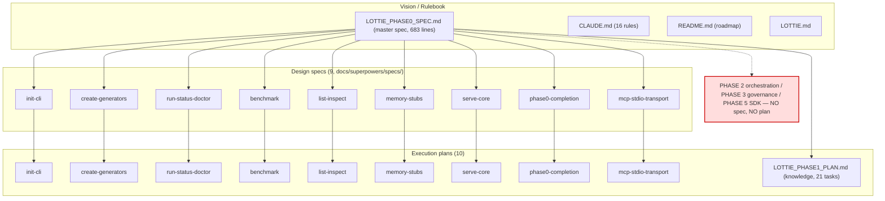
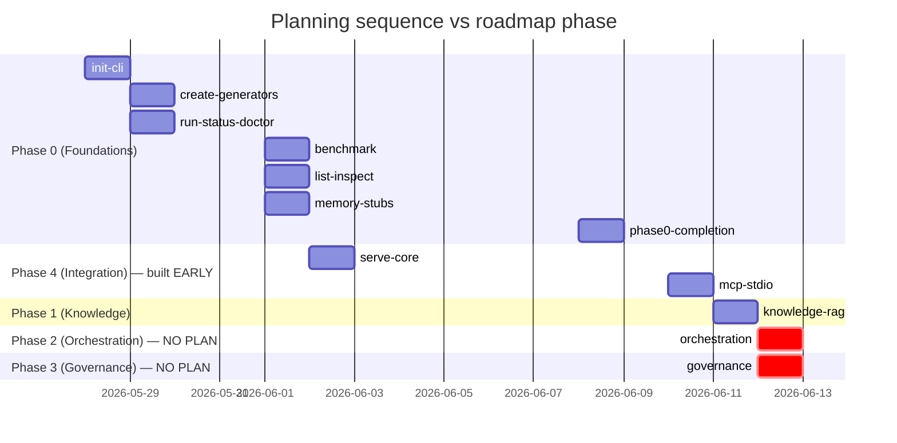

# Lottie Orchestrator — Plan & Roadmap Audit

**Audit date:** 2026-06-12
**Auditor role:** Principal Software Architect / Staff+ AI Platform Engineer / Security Engineer / Technical Writer
**Repository:** `lottie-orchestrator` (import name `lottie`)
**Branch audited:** `docs/readme-codecov`
**Subject of this audit:** the **planning corpus** — not the running code. Specifically: `LOTTIE_PHASE0_SPEC.md` (master spec), `LOTTIE_PHASE1_PLAN.md`, `README.md` roadmap, `CLAUDE.md` rulebook, the 9 design specs in `docs/superpowers/specs/`, and the 10 execution plans in `docs/superpowers/plans/`.
**Method:** Full read of all 21 planning documents by three parallel readers, cross-corroborated. Every claim is anchored to a document/line. Where a planning document is *silent* on a topic a mature spec would cover, that silence is reported as a finding rather than assumed.

> **Companion document.** This is the planning analogue of `docs/architecture-audit-report.md` (which audits the *code*). Read together they answer two distinct questions: *is the system built well?* (code audit) and *is the system planned well?* (this audit). The most important cross-cutting result: **the plan and the code agree about what is missing** — orchestration, governance, runtime security, and durability are absent in both. That alignment means the gaps are deliberate phasing, not accidental drift. The risk is not that the team lost track; it is that the hardest, most differentiating layers have *no plan at all yet*, while the documentation already markets them as the product.

---

## Executive Summary

### Overall assessment

The Lottie planning corpus is, at the **execution-plan and per-feature-design level, unusually disciplined** — among the better in-repo planning bodies one encounters. Every shipped feature has a paired design spec and a TDD-driven execution plan following a consistent template (Goal → Scope/out-of-scope → schemas → flow → test strategy → verification gate). Deferrals are named explicitly. CLAUDE.md rules are cited inline by number. Dependency sequencing is real (the Phase 1 plan has a formal dependency table). This is the work of a team that knows how to plan a slice and ship it.

The weakness is **not granularity or rigor — it is altitude and coverage.** The planning corpus is excellent at the *mechanical, well-understood* surface (CLI, scaffolding, retrieval, transport) and **entirely absent at the architecturally hard, product-defining layers**:

- **No plan exists for Phase 2 (multi-agent orchestration / agent mesh)** — the capability the product is named for.
- **No plan exists for Phase 3 (governance: policy engine, audit log, cost tracker).**
- **No plan exists for Phase 5 (public SDK).**
- **No design spec exists for the entire `knowledge/` subsystem** (the most-built subsystem after the CLI) — it was planned only at the coarse `LOTTIE_PHASE1_PLAN.md` level.
- **No design spec exists for the runtime security gates** (`InputSanitizerSkill`, `OutputValidationSkill`, `CapabilityEnforcerSkill`) — they are referenced as "swap in later" but never designed anywhere.

The master spec (`LOTTIE_PHASE0_SPEC.md`) is **ambitious and broad** — it commits to a LangGraph mesh, a full governance triad, 5-checkpoint security, 5-tier memory, four serving transports, and a public SDK — but it is **silent on the non-functional foundations** any of those layers require: authentication/authorization, multi-tenancy, durable execution, retries/timeouts, rate limiting, distributed tracing, deployment/IaC, secrets-at-rest, data residency, schema migration, and disaster recovery. It also contains **internal contradictions** about when security and governance ship (stated three different ways).

### Key strengths of the plan

1. **Consistent, repeatable design methodology** — problem→approach→schema→tests→deferrals in all 9 specs; rigor *increases* over time (decisions tables, risk sections, "verified API facts").
2. **Genuinely TDD-driven execution plans** — every task is failing-test→implement→pass→commit; full test bodies inlined; a dedicated verification-gate task closes each plan.
3. **Explicit, first-class deferral discipline** — every spec/plan names what it is *not* doing, so scope is honest within each slice.
4. **Real dependency sequencing** — the Phase 1 plan has a formal dependency/unblocks table; discovery-vs-loading separation is a deliberate, documented architecture decision.
5. **Security *seams* designed before security *enforcement* exists** — `SecurityGate` is introduced as an identity chokepoint specifically so real skills can swap in "zero call-site change." Good architectural foresight even though the enforcement is still stubbed.
6. **Evidence the plans were executed and self-corrected** — "Amendments (applied during execution)" and "Self-review notes" sections show the plans are living documents, not write-once theater.

### Major risks in the plan

| # | Risk | Severity |
|---|------|----------|
| PR1 | The three hardest, most differentiating layers (orchestration, governance, durable execution) have **no execution plan and no design spec** | **Critical** |
| PR2 | The `knowledge/` subsystem — the largest built area after CLI — has **no per-feature design spec** (only coarse plan-level coverage) | **High** |
| PR3 | Runtime security gates (rules 8, 9, 11) are **named but never designed**; `CapabilityEnforcerSkill` is unplanned despite being a "non-negotiable" rule | **High** |
| PR4 | The master spec is **silent on all enterprise NFRs** (auth, multi-tenancy, durability, tracing, IaC, DR, migration, rate limiting) | **High** |
| PR5 | **Phase-ordering inversion**: Phase 4 (serving/MCP) was planned and built before Phases 2 (orchestration) and 3 (governance) | **Medium** |
| PR6 | **Internal contradictions** in the spec about when security/governance ship (Phase 1 vs Phase 2 vs Phase 3, stated three ways) | **Medium** |
| PR7 | **No coverage gate in CI** for Phases 0/4; only Phase 1 asserts ≥80%. Plans 1–7 were built before any CI existed | **Medium** |
| PR8 | **No design spec covers `core/` or `llm/`** — the foundational abstractions everything depends on were introduced incidentally inside feature plans | **Medium** |
| PR9 | The AI code-generation path designs **static scans only, no execution sandbox** — the entire safety envelope for LLM-written code is mypy/ruff/bandit + one retry | **Medium** |
| PR10 | "Doc before code" (rule 3) was **violated by the plan itself** — `PromptInjectionScanSkill` exists in code with no design spec | **Low** |

### Top recommendations (condensed — full list below)

1. **Write the Phase 2 (orchestration) and Phase 3 (governance) design specs now**, before more transport slices — these define the product and currently have zero design coverage.
2. **Add an NFR/architecture spec** covering auth, multi-tenancy, durability, tracing, deployment, and migration — the master spec's largest blind spot.
3. **Retroactively spec the `knowledge/` subsystem and the runtime security gates** to restore the "doc before code" discipline the corpus otherwise upholds.
4. **Reconcile the three conflicting statements** of when security/governance ship; pick one phasing and propagate it across spec/README/CLAUDE.md.
5. **Add a CI coverage gate** to match the Phase 1 standard across all phases.

**Overall plan quality score: 6.5 / 10** — excellent slice-level engineering discipline, undercut by the complete absence of planning for the product-defining layers and all enterprise NFRs.

---

## Planning Corpus Overview

### Document inventory

### Phased roadmap as planned

| Phase | Tag | Scope (as written) | Stated status | Exit criteria in plan? | Execution plan exists? |
|-------|-----|--------------------|---------------|------------------------|------------------------|
| 0 Foundations | v0.1.0 | BaseAgent/Skill, CLI, generators, MockLLM, CI, ScaffolderAgent | ✅ | Yes — Phase-0 deliverables checklist (SPEC §8) | **Yes** (plans 1–8) |
| 1 Knowledge Core | v0.2.0 | ChromaDB, RAG, knowledge graph, ingest scanning | ✅ done (610 tests, 99% cov) | **Yes** — only phase with a real coverage gate (≥80%) + Round-4 sign-off | **Yes** (`LOTTIE_PHASE1_PLAN.md`) |
| 2 Agent Mesh | v0.3.0 | LangGraph engine, supervisor, parallel runner | ◻ not started | **No** | **No** |
| 3 Governance | v0.4.0 | audit trail, policy engine, OpenTelemetry | ◻ not started | **No** | **No** |
| 4 Integration | v0.5.0 | MCP, OpenAI-compat, REST, (WebSocket) | 🚧 MCP stdio only | **No** | **Partial** (serve-core + MCP stdio = "slice 1") |
| 5 Public SDK | v1.0.0 | SDK, docs site, plugin system, demos | ◻ not started | **No** | **No** |

**Only Phases 0 and 1 have stated exit criteria.** Phases 2–5 have scope bullets and nothing else. (Evidence: SPEC §10 L416-423; README L77-84; `LOTTIE_PHASE1_PLAN.md` §1, §7.)

---

## Plan Quality Review

### Design-spec methodology — strong and improving

The 9 design specs follow a consistent template that crystallizes at the `benchmark`/`memory-stubs` specs (2026-06-01) and holds: **Goal → Scope decisions (in/out) → module layout → Pydantic schemas (with type-choice justification against rule 6) → per-component flow → test strategy (TDD, no real LLM) → out-of-scope → verification gates.**

Rigor signals observed in nearly every spec:
- **Out-of-scope is a first-class named section in all 9** — the single most consistent quality marker.
- **Schemas defined wherever introduced**; `dict[str, object]` chosen over `Any` and justified inline (benchmark spec, serve spec, memory spec).
- **Trade-off analysis deepens over time:** `create` analyzes `PackageLoader` vs `FileSystemLoader` for wheel survival; `memory-stubs` contains a standout import-cycle analysis; `serve-core` documents sync-vs-async; `mcp-stdio` justifies low-level `Server` over FastMCP because tools are dynamic.
- **CLAUDE.md rules cited by number inline** (rules 2, 5, 6, 8, 9, 11, 12, 13 all appear).

The two earliest specs (`init`, `run/status/doctor`) lack a formal decisions table — acceptable given their simplicity. Net: **a disciplined, repeatable, reviewable spec process.**

### Execution-plan methodology — genuinely TDD-driven

All 10 plans open with the same banner (`REQUIRED SUB-SKILL: superpowers:subagent-driven-development`) and use an identical per-task cycle: **write failing test → run/expect-fail → implement → run/pass → commit (conventional message inlined).** Each plan ends with a dedicated verification-gate task (`pytest` + `mypy --strict` + `ruff` + often a manual smoke). Test bodies are inlined, not described.

Rigor increases with plan size: later/bigger plans add Spec cross-references, Decisions tables, Risks sections, Self-review notes, and "Verified API facts (do not re-derive)" (the MCP plan pins the exact SDK API to avoid hallucinated calls). The `phase0-completion` plan (14 tasks) and `LOTTIE_PHASE1_PLAN.md` (21 tasks, 9 sub-phases, formal dependency table) are markedly more rigorous than the early `init` plan (no risks section).

**Evidence the plans are executed, not theater:** the `create-generators` plan has an "Amendments (applied during execution)" section documenting 5 post-hoc fixes — including a missing-`__init__.py` packaging defect "invisible to every in-repo test until the manual smoke." `LOTTIE_PHASE1_PLAN.md` is marked complete with concrete numbers (610 passed, 99% coverage).

### Where the methodology weakens

- **Review is mostly self-review.** Plans embed "Self-review notes"; only Phase 1 has a formal external sign-off concept ("Round-4 checklist"). No independent design review gate is evident in the corpus.
- **CI maturity lagged the plans.** CI did not exist until the 2026-06-08 plan (Task 8) — plans 1–7 (init through serve-core) were built **before any CI workflow existed**. Even once added, CI runs coverage **report-only, no threshold**. Only Phase 1 asserts a real ≥80% gate. So for most of the corpus, "done" = green *local* gate + self-review, not CI-enforced coverage.
- **"Doc before code" was violated by the plan itself** for `PromptInjectionScanSkill` — it exists in code with no design spec, the inverse of rule 3 the specs otherwise preach.

---

## Coverage Analysis

### Coverage map — what is planned vs. silent

| Subsystem (per CLAUDE.md structure) | Design spec? | Execution plan? | Notes |
|-------------------------------------|:------------:|:---------------:|-------|
| CLI: init/create/run/status/doctor/list/inspect/benchmark/serve | **Yes (6)** | **Yes (8)** | Best-covered area |
| `core/` (BaseAgent, BaseSkill, registry) | **No** | Incidental | Introduced inside other plans (memory-stubs wires `self.memory`) |
| `llm/` (LLMProvider, MockLLM, litellm) | **No** | Incidental | `build_provider` introduced inside run/status/doctor — never a standalone design |
| `serve/` core + MCP transport | **Yes (2)** | **Yes (2)** | Phase 4 "slice 1" |
| `memory/` | **Yes** (stubs only) | **Yes** | Real stores explicitly deferred |
| `security/` skills + write gate | **Partial** | **Partial** | SecretDetection/CodeScan/Validator/write-gate designed in phase0-completion; runtime gates **not designed** |
| `knowledge/` (manifest, frontmatter, chunking, embeddings, graph, ingest, store) | **No** | Plan-level only (`LOTTIE_PHASE1_PLAN.md`) | **8+ modules, no per-feature spec** |
| `governance/` (audit, policy engine, cost tracker) | **No** | **No** | Empty module; `policies/base.yaml` scaffolded inert, no consumer planned |
| Orchestration / multi-agent (LangGraph, SPEC §13) | **No** | **No** | Explicitly out-of-scope in every spec that mentions it |

### The five biggest planning gaps

**Gap 1 — Orchestration (the product's headline) has no plan and no design.**
CLAUDE.md's one-line pitch is "multi-agent framework"; SPEC §13 (L579-608) confirms LangGraph as the supervisor→specialists engine with checkpointing, conditional routing, and time-travel replay. **No spec designs it. No plan builds it.** Every serving spec explicitly defers "multi-agent orchestration / routing / supervisor" (serve-core spec L187; MCP spec L188). The serving layer is built over a single-agent `run_agent` path — there is no agent-to-agent calling anywhere in any plan. The product can *serve* and *retrieve* before it can *orchestrate*, which is the inverse of where the value proposition lives.

**Gap 2 — Governance is entirely unplanned.**
`src/lottie/governance/` is empty; `policies/base.yaml` is *generated inert* by `init` (allow/deny/escalate keys) but **no spec consumes it** — there is no policy-engine design. The audit logger, policy engine, and cost tracker (CLAUDE.md `governance/`) have no design spec and no execution plan. Cost is *captured* per run (`RunMetrics.cost_usd`) but the cost-*tracker*/budget-*enforcement* layer is undesigned. `lottie audit` is deferred by the benchmark spec (L186); per-call audit logging is a deferred Phase-3 follow-up in the MCP spec (L201).

**Gap 3 — The runtime security gates are the repeatedly-deferred hard problem.**
Three specs (`run/status/doctor`, `serve-core`, `mcp`) ship execution paths while `SecurityGate` is **identity (pass-through)**. `InputSanitizerSkill`, `OutputValidationSkill`, and `PromptInjectionScanSkill` (rules 8/9/10) are named as "swap in later" but **no spec designs them**. `CapabilityEnforcerSkill` (rule 11) — the runtime enforcement of the `capabilities: []` field that `create` scaffolds into every agent — is **never designed in any spec**, despite being a "non-negotiable" CLAUDE.md rule. The Phase 1 plan §6 (L434) honestly admits it: capabilities are *declared* but *not enforced*, and "full runtime `CapabilityEnforcerSkill` may remain a Phase 2 item — note, don't silently assume it."

**Gap 4 — The knowledge subsystem got the lightest design treatment despite being the hardest part.**
`src/lottie/knowledge/` (manifest, frontmatter, chunking, embeddings, graph, ingest, store — 8+ modules) has **zero per-feature spec in `docs/superpowers/specs/`**. It was planned only at the coarser `LOTTIE_PHASE1_PLAN.md` level (sub-phases A–I). The networkx graph query layer, the structured-retrieval-before-semantic rule (rule 16), and `GraphIngestSkill` never received the problem→schema→tests→deferrals treatment the CLI commands did. This is the single largest coverage *asymmetry*: the differentiating, graph-first knowledge layer got lighter design than `lottie list`.

**Gap 5 — `core/` and `llm/` — the foundational abstractions — were never given a design spec.**
`BaseAgent`, `BaseSkill`, the instrumentation loop, `LLMProvider`, and `build_provider` are the load-bearing abstractions everything else depends on. They were introduced *incidentally* inside feature plans (e.g. `build_provider` first appears in the run/status/doctor plan). The most-reused contracts in the system have no dedicated design rationale document.

---

## NFR & Enterprise-Readiness Gaps in the Plan

The master spec commits to enterprise-grade capabilities (governance, multi-agent, four transports, SDK) but is **silent on the non-functional foundations** those capabilities require. The following are absent from *all* planning documents:

| NFR / capability | Status in plan | Why it matters |
|------------------|----------------|----------------|
| **AuthN / AuthZ / RBAC** | **Silent.** `serve` exposes agents as MCP/HTTP/REST endpoints; MCP plan lists "auth" as explicitly out-of-scope (L641). Only "permission" concept is per-agent capability scoping (unbuilt). | Blocking for any networked deployment |
| **Multi-tenancy / isolation** | **Silent.** No tenant boundary, namespace isolation, or per-tenant quota. `memory.namespace` is per-agent, not per-tenant. | Required for SaaS / enterprise |
| **Durable execution** | **Silent.** LangGraph checkpointing named conceptually (SPEC L584) but no spec for where checkpoints persist, durability guarantees, or crash recovery of a paused HITL run. Everything is sync, in-process. | Required for "1,000 workflows" |
| **Retries / backoff / timeouts / idempotency** | **Silent.** `retry_rate` is *measured* and conditional edges "retry with different provider" is mentioned, but no retry policy, backoff, timeout, or idempotency is specified. | Reliability floor |
| **Rate limiting / quotas / concurrency caps** | **Silent.** Only `max_tokens_per_run` + a vague "circuit breaker" for DoS. No request-rate limits, no concurrency model for the serving layer. | DoS / cost protection |
| **Distributed tracing / structured logging** | **Near-silent.** OpenTelemetry named once for *benchmark-metric* streaming (SPEC L279), not for request tracing, span propagation, or correlation IDs across multi-agent graphs. | Production debuggability |
| **Deployment / IaC / runtime topology** | **Silent.** No Dockerfile, container, K8s, Helm, or serverless plan. Distribution is "pip install." No statement of how `serve` is hosted, scaled, or load-balanced in production. | Operability |
| **Runtime secrets management** | **Silent.** `SecretDetectionSkill` *detects* secrets in content; no plan for how the system's own provider API keys are stored, rotated, or injected at runtime. | Security baseline |
| **Data residency / privacy / encryption-at-rest** | **Silent.** No PII-handling policy beyond an example `no-pii` policy *name*. No retention/deletion/residency/encryption spec for `audit.db` or `chroma/`. | Compliance |
| **Versioning / schema migration** | **Partial.** SemVer of releases specified (SPEC §10); no data-migration story for knowledge-file format changes, audit-DB schema evolution, or breaking Pydantic-contract changes. | Upgrade safety |
| **Disaster recovery / backup** | **Silent.** No backup/restore/DR plan for the *immutable, authoritative* audit log or the knowledge corpus. | Business continuity |
| **SLAs / availability / health endpoints** | **Silent.** `doctor` checks env health, but no uptime target, liveness/readiness endpoint, or degradation policy. | Enterprise contracts |
| **Cost *enforcement* (vs. tracking)** | **Silent.** Cost is tracked and budgets mentioned for DoS, but no spec for what happens when a budget is exceeded (hard stop? escalate? degrade?) or org-level ceilings. | FinOps |

**This is the master spec's single largest blind spot.** A plan that commits to "AI governance" and "enterprise deployment" while saying nothing about auth, tenancy, durability, or DR is planning the *features* without planning the *platform they run on*.

---

## Internal Consistency Review

The corpus contains several unreconciled contradictions — minor individually, but collectively they erode trust in the roadmap as a single source of truth.

1. **Security/governance phasing is stated three different ways.** SPEC §10 puts Governance at Phase 3/v0.4.0; SPEC §12 says the security module ships in Phase 1 ("security cannot wait", L536); SPEC §12's skill table tags `CapabilityEnforcerSkill` and `CodeSecurityScanSkill` as "(Phase 2)" (L553-554). A reader cannot determine when capability enforcement is supposed to exist.
2. **"Policy store" (Phase 1, L419) vs "policy engine" (Phase 3, L421)** — overlapping terms, never reconciled. Is policy a Phase 1 deliverable or a Phase 3 one?
3. **Serving transports described inconsistently.** SPEC L72 promises MCP + OpenAI-compat + REST + **WebSocket** from `serve --port 8080`; README roadmap drops WebSocket; CLAUDE.md L99 defers `--port`/HTTP entirely to "later Phase-4 slices." The MCP spec itself flags this as a known, documented divergence awaiting the REST slice.
4. **`serve/` module appears in README's architecture but is absent from SPEC §4 and CLAUDE.md's** `src/lottie/` structure listings — the structure diagrams disagree.
5. **Duplicate section numbering** in SPEC (two `## 8` headers) suggests the deliverables checklist was inserted without renumbering — a small signal that the master spec has drifted as it grew.

---

## Sequencing Review

**Actual planning order (by document date):** init (05-28) → create (05-29) → run/status/doctor (05-29) → benchmark (06-01) → list/inspect (06-01) → memory-stubs (06-01) → serve-core (06-02) → phase0-completion + CI (06-08) → MCP stdio (06-10) → Phase 1 knowledge (undated, marked complete).

**Phase 4 (serving/MCP) was planned and built before Phases 2 (orchestration) and 3 (governance) — confirmed.** The serve-core plan (06-02) and MCP plan (06-10, self-described "Phase 4 slice 1") predate any Phase 2/3 plan, of which there are none. Building the transport before the thing being transported is a defensible *demo* strategy (you can show agents responding over MCP), but it means the serving layer is architected around single-agent `run_agent` with an identity security gate — and retrofitting multi-agent routing and real governance into that surface later is harder than designing it in from the start.

**Assessment:** the sequencing optimizes for *visible, shippable slices* (you can `init`, `create`, `run`, `benchmark`, `serve`, and `retrieve` today) at the cost of *architectural foundation-first ordering*. For an early-stage project chasing demos, this is a reasonable bet; for a project marketing itself as a governed multi-agent platform, it defers exactly the layers that justify the marketing.

---

## Comparison to Mature Platform Planning

How the plan reads against how Temporal / Dagster / LangGraph / Airbyte / OpenAI Agents SDK *plan* comparable systems:

| Planning dimension | Mature-platform norm | Lottie plan |
|--------------------|----------------------|-------------|
| Durable-execution design (checkpoint store, recovery semantics) | Designed first — it's the core invariant (Temporal, Dagster) | **Absent** — named conceptually, never specified |
| Orchestration model (DAG / graph / supervisor) spec | Central design doc with state model, routing, failure semantics | **Absent** — deferred in every spec, no design |
| Multi-tenancy & isolation model | Explicit boundary, quota, data-isolation spec | **Absent** |
| AuthN/Z & RBAC design | Required before any networked transport | **Absent** — auth explicitly out-of-scope |
| Observability/tracing design (spans, lineage) | First-class (Dagster asset lineage, OTel) | **Near-absent** — OTel only for benchmark metrics |
| Connector/source model (incremental, schema evolution) | Core spec (Airbyte/Fivetran) | **Minimal** — ingest is text/file; URL deferred; no incremental/schema-evolution plan |
| Per-feature design discipline | Varies; often lighter than Lottie's | **Stronger than typical** — Lottie's slice-level specs are a genuine strength |
| TDD / test-first execution plans | Rare to see this explicit | **Stronger than typical** |
| Deferral / out-of-scope honesty | Varies | **Stronger than typical** |

**Net:** Lottie *out-plans* mature platforms at the slice level (its per-feature TDD specs are better than what most teams write) and *under-plans* them at the platform level (the invariants those platforms are built around — durability, orchestration, tenancy, auth — are exactly what Lottie hasn't specced).

---

## Plan-Maturity Scorecard

| Dimension | Score (1-10) | Notes |
|-----------|:---:|-------|
| Vision clarity | 7 | Ambitious, coherent product vision; undercut by internal contradictions and overstated current status |
| Roadmap completeness | 4 | Only Phases 0–1 have exit criteria; Phases 2/3/5 are scope bullets with no plan |
| Design-spec rigor (per feature) | 8 | Consistent, schema-first, deferral-honest, improving over time |
| Execution-plan rigor (TDD/sequencing) | 9 | Genuinely test-first, dependency-sequenced, self-correcting |
| Coverage of hard layers (orchestration/governance/durability) | 2 | No spec, no plan for any of them |
| NFR / enterprise-readiness coverage | 2 | Silent on auth, tenancy, durability, tracing, IaC, DR, migration |
| Security planning | 5 | Code-gen gate well-designed; runtime gates + capability enforcement undesigned |
| Internal consistency | 5 | Three conflicting security/governance phasings; transport list disagreements |
| Process discipline (CI, review, gates) | 6 | Strong local gates + self-review; CI lagged; coverage gate only in Phase 1 |

**Composite plan-maturity: ~5.3 / 10** — exceptional micro-planning, near-absent macro-planning.

---

## Prioritized Recommendations

### Immediate (0–30 days)

| # | Recommendation | Impact | Effort | Priority |
|---|----------------|--------|--------|----------|
| 1 | **Reconcile the three security/governance phasing statements** and the transport-list disagreements; make one roadmap the source of truth | High (trust) | Low | P0 |
| 2 | **Write a Phase 2 (orchestration) design spec** — state model, routing, failure/HITL semantics, multi-agent calling protocol — before more transport slices | High | Medium | P0 |
| 3 | **Write a Phase 3 (governance) design spec** — policy-engine evaluation model consuming `policies/*.yaml`, audit-log schema, cost-budget enforcement | High | Medium | P0 |
| 4 | **Add a CI coverage gate** matching the Phase 1 ≥80% standard across all phases | Medium | Low | P1 |
| 5 | **Retroactively spec the runtime security gates** (`InputSanitizer`, `OutputValidation`, `CapabilityEnforcer`) — they're "non-negotiable" rules with no design | High (security) | Medium | P1 |

### Near-term (1–3 months)

| # | Recommendation | Impact | Effort | Priority |
|---|----------------|--------|--------|----------|
| 6 | **Author an NFR/architecture spec** covering auth/RBAC, multi-tenancy, durability, tracing, deployment/IaC, secrets-at-rest, migration, DR | High | High | P1 |
| 7 | **Retroactively spec the `knowledge/` subsystem** (graph query layer, retrieval orchestration, `GraphIngestSkill`) to match CLI-level design rigor | Medium | Medium | P2 |
| 8 | **Write `core/` and `llm/` design rationale docs** so the foundational contracts have explicit, reviewable design | Medium | Low | P2 |
| 9 | **Design the AI code-gen execution sandbox** — static scans alone are an insufficient envelope for arbitrary LLM-written code | Medium | Medium | P2 |
| 10 | **Add a design-review gate** (independent review, not only self-review) to the planning process | Medium | Low | P2 |

### Strategic (3–12 months)

| # | Recommendation | Impact | Effort | Priority |
|---|----------------|--------|--------|----------|
| 11 | **Decide durability strategy** (Temporal-style engine vs. typed DAG runtime vs. home-grown checkpoint store) and spec it — this is the gating decision for "1,000 workflows" | Very High | High | P1 |
| 12 | **Spec Phase 5 (SDK + plugin system)** including the public API surface, versioning, and backward-compat policy | High | High | P2 |
| 13 | **Define SLOs** (latency/throughput/availability) and a load/scale test plan; the spec currently has no numeric targets | High | Medium | P2 |
| 14 | **Plan a data-governance layer** (retention, residency, encryption, deletion) for the audit log and knowledge corpus | High | Medium | P2 |

---

## CTO Review (Plan-Focused Due Diligence)

*Framing: as a technical investor, what does the planning corpus tell me about this team and this product?*

### What would you approve?
- **The team can plan and execute a slice with real discipline.** TDD-driven plans, schema-first specs, honest deferral sections, self-correcting amendments, dependency sequencing. This is a *capable* team with *good engineering hygiene*. The Phase 1 plan (21 tasks, dependency table, ≥80% coverage gate, achieved 99%) is genuinely impressive micro-planning.
- **The deferral honesty is a strength** — every spec says what it isn't doing, so there's little hidden scope within a slice.

### What would concern you?
- **The plan markets a platform it has not planned.** Orchestration, governance, and durability — the three things that distinguish a "multi-agent orchestrator with AI governance" from a single-agent runner — have *zero design coverage*. The product's name describes unplanned work.
- **The master spec is silent on every enterprise NFR** (auth, tenancy, durability, tracing, IaC, DR, migration). A spec can't claim "enterprise deployment" while saying nothing about how the thing is secured, isolated, hosted, or recovered.
- **Internal contradictions** about when security/governance ship suggest the roadmap is aspirational copy that hasn't been reconciled with the build plan.
- **Phase-ordering inversion** (transport before orchestration/governance) optimizes for demos over foundations — fine for a seed-stage demo, concerning if the pitch is enterprise.

### What would block enterprise adoption (at the planning level)?
1. No orchestration design — can't evaluate the core value prop.
2. No governance design — the "AI governance" pillar is unplanned.
3. No auth/tenancy/durability/DR plan — can't assess production fitness.
4. No SLOs — no contractible performance commitments.

### What would you require before investing $10M?
1. **A reconciled, single-source roadmap** with real exit criteria for every phase.
2. **Design specs for Phase 2 (orchestration) and Phase 3 (governance)** at the same rigor as the existing CLI specs.
3. **An NFR/architecture spec** covering auth, multi-tenancy, durable execution, tracing, deployment, and DR.
4. **A durability strategy decision** (build vs. adopt) with a spec.
5. **Numeric SLOs and a load-test plan.**
6. **A data-governance plan** for the audit log and knowledge corpus.

**Verdict:** The planning corpus reveals a team with **excellent tactical discipline and an under-specified strategic core.** The slice-level specs would pass review at most serious engineering orgs. The platform-level plan would not — because for the layers that define the product, there is no plan to review. The asset is the team's demonstrated ability to plan-and-ship; the risk is that they have not yet *pointed that ability* at orchestration, governance, or the enterprise NFRs the product promises. That is a *fixable* gap (write the specs) — but until it is fixed, the documentation is writing checks the plan can't yet cash.

---

## Evidence Appendix

### Roadmap & vision
- Two disagreeing roadmap tables: `LOTTIE_PHASE0_SPEC.md` §10 L416-423; `README.md` L77-84
- Only Phase 0/1 have exit criteria: SPEC §8 L330-348; `LOTTIE_PHASE1_PLAN.md` §1 L15, §7
- Orchestration planned (LangGraph) but undesigned: SPEC §13 L579-608
- Governance triad named: CLAUDE.md L44; README L32; placement conflict SPEC L419 vs L421
- Internal contradictions: security phasing SPEC §10 vs §12 L536 vs skill table L553-554; transports SPEC L72 vs README L83 vs CLAUDE.md L99; duplicate `## 8` headers in SPEC

### Design specs (`docs/superpowers/specs/`)
- Methodology consistency: out-of-scope section in all 9; rule citations inline (benchmark:91, serve:71, memory:92)
- SecurityGate as identity chokepoint, swap-in design: `2026-06-02-lottie-serve-core-design.md` L24-30, L91-112
- Rule-13 code-gen gate designed: `2026-06-08-phase0-completion-design.md` L54-60, L87
- MCP wire-format deferred to implementation: `2026-06-10-mcp-stdio-transport-design.md` L100-104, L147
- No knowledge subsystem spec: confirmed absent from `docs/superpowers/specs/`
- Runtime gates / CapabilityEnforcer never designed: serve spec L184-186; MCP spec L185

### Execution plans (`docs/superpowers/plans/` + `LOTTIE_PHASE1_PLAN.md`)
- TDD banner + per-task cycle: every plan, e.g. `2026-05-28-lottie-init-cli.md` L145
- Plans executed/self-corrected: `2026-05-29-lottie-create-generators.md` "Amendments" L1098-1119
- CI introduced late, report-only coverage: `2026-06-08-phase0-completion.md` Task 8 L1176, L1201
- Phase 1 dependency table + coverage gate: `LOTTIE_PHASE1_PLAN.md` §2 L21-31, §1 L15, completion L459-461
- Phase 1 admits capability-enforcement gap: `LOTTIE_PHASE1_PLAN.md` §6 L434
- Phase 4 before Phase 2/3: serve-core dated 06-02, MCP "slice 1" 06-10; no Phase 2/3 plan exists
- Auth deferred: `2026-06-10-mcp-stdio-transport.md` L641

### NFR silences (absent across all planning docs)
- Auth/RBAC, multi-tenancy, durable execution, retries/timeouts, rate limiting, distributed tracing, deployment/IaC, runtime secrets, data residency, schema migration, DR/backup, SLOs — none specified anywhere in the corpus

---

## Audit Summary

### Critical findings
1. **Orchestration (Phase 2), governance (Phase 3), and durable execution have no design spec and no execution plan** — the product-defining layers are entirely unplanned.

### High-priority findings
2. **The `knowledge/` subsystem has no per-feature design spec** despite being the largest built area after the CLI.
3. **Runtime security gates (rules 8/9/11) are named but never designed**; `CapabilityEnforcerSkill` is unplanned despite being "non-negotiable."
4. **The master spec is silent on every enterprise NFR** (auth, tenancy, durability, tracing, IaC, DR, migration).
5. **Internal contradictions** state security/governance phasing three different ways and disagree on serving transports.

### High-priority recommendations
1. Reconcile the roadmap into one source of truth (P0, low effort).
2. Write Phase 2 (orchestration) and Phase 3 (governance) design specs at existing-spec rigor (P0).
3. Author an NFR/architecture spec (auth, tenancy, durability, tracing, deployment, DR) (P1).
4. Retroactively spec the knowledge subsystem and the runtime security gates (P1–P2).
5. Add a CI coverage gate across all phases (P1).

### Overall plan quality score: **6.5 / 10**
Exceptional slice-level planning discipline (TDD execution plans, schema-first design specs, honest deferrals) undercut by the complete absence of planning for orchestration, governance, durability, and all enterprise NFRs — the exact layers the product markets. **Composite plan-maturity: ~5.3 / 10.** The gap is fixable by writing the missing specs; until then, the documentation overstates a platform the plan has not yet designed.
